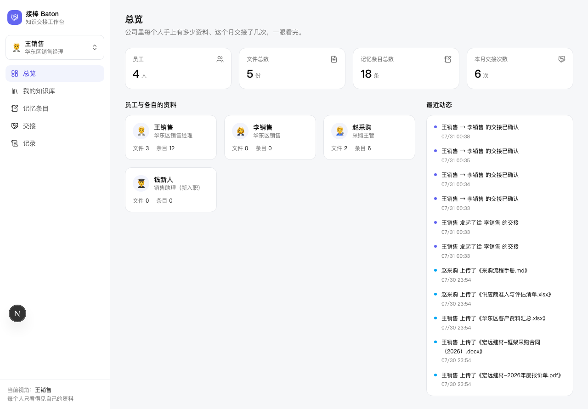

# 接棒 Baton

> 给小公司每个人配一个 Agent，管住自己手上的资料。
> 同事之间可以互相问对方的 Agent；人走了或者换岗，**一键把该给的交出去**。

[](https://github.com/LeoLee0812/baton/commits/main)
[](https://nextjs.org)
[](https://supabase.com)
[](https://www.typescriptlang.org)
[](https://vitest.dev)
[](https://playwright.dev)
[](https://baton.saveme505.help)

线上：**https://baton.saveme505.help**（私人站点，进站需统一访问密码）

---

## 它解决什么问题

小公司里，一个人手上的东西全在他自己脑子和电脑里：

- 这个客户的账期是特批的月结 60 天，别人不知道
- 这家的报价底线是 186，再往下要走审批，别人不知道
- 他们采购主管签字权只有 50 万，越过他直接找副总会得罪人，别人更不知道

这个人一离职，这些东西就跟着走了。交接会开三次，写下来的还是「客户名单.xlsx」。

**接棒**把这件事变成一个可以点的流程：每个人的资料只属于自己 → 系统从资料里抽出「值得交接的结论」→ 走的时候勾一遍 → 对方确认 → 该给的给出去，不该给的留下。

---

## 五个功能

| # | 功能 | 现在做到哪 |
|---|---|---|
| 1 | 一人一个 Agent，各自的资料互相看不见 | ✅ 网页侧全做完，有专门的负向测试守着 |
| 2 | 上传资料，Agent 自动学 | ✅ 真解析（PDF/docx/xlsx/txt/md）→ 真切片 → 真 embedding → 真入库，出处精确到第几页 |
| 3 | 飞书私聊问自己的 Agent | ⬜ 服务器 Agent 层未施工（见「已知边界」） |
| 4 | 我的 Agent 去问老王的 Agent | ✅ 网页侧做完：只能问到对方开了开关的条目，只允许一跳，全程留痕 |
| 5 | 一键交接 | ✅ 做完做透——这是项目的心脏 |

---

## 界面

浅色干净风，五个页面：

| 页面 | 做什么 |
|---|---|
| **总览** | 四个数字卡 + 员工卡片墙 + 动态时间线 |
| **我的知识库** | 拖进来就解析入库；点一行在抽屉里看全部切片，每片标着它在原文的第几页 / 哪个章节 / 哪个行区间 |
| **记忆条目** | 按五类分组的卡片，每条带出处小字和三个开关：可编辑 / 同事可问到 / 交接时默认勾选 |
| **交接** | 左边选人选原因，右边勾选清单，底部预览「接手人会看到什么」，顶部三步进度条 |
| **记录** | 交接记录 + 跨人提问记录，只增不改 |



---

## 交接是怎么设计的

一句话：**交接 = 授予可见权，不是搬走数据。**

```
draft ──提交──> submitted ──对方打开──> viewed ──对方确认──> completed
                    │                                          │
              此时接手人                                   此时才盖 granted_at
              一条都看不到                                 被勾选内容才可见
```

三条硬约束，每一条都有专门的自动化测试：

1. **没确认之前，接手人什么都看不到**——连检索都搜不到（`AC-5.2.1` / `AC-3.2.3`）
2. **确认之后，勾了的能看到**，且结果上标注「来源：王销售 交接，2026-07-31」（`AC-5.2.2` / `AC-3.2.2`）
3. **确认之后，没勾的仍然看不到**——这是负向测试，最容易被漏掉（`AC-5.2.4`）

外加：**`owner_employee_id` 前后完全不变**（`AC-5.2.3`）。代码里从头到尾没有一处 `update bt_memories set owner_employee_id`——原始归属必须留痕，否则「这是谁的资料」这个问题就永远说不清了。

离职原因的交接完成后，发起人未交接的内容会被标「已随账号封存」，**数据不删**（`AC-5.3.2`）。

---

## 技术选型与几个真踩过的坑

| 事情 | 选择 | 为什么 |
|---|---|---|
| 中文全文检索 | **pg_trgm**，⛔ 不用 `to_tsvector('chinese')` | Supabase 托管版没有 `zhparser` / `pg_jieba`，中文分词扩展根本装不上。trigram 逐字滑窗反而更贴合中文 |
| 混合检索 | 向量 + 模糊两路，**RRF(k=60)** 融合 | 中文客户名的向量召回不稳，模糊那一路必须真生效——测试里刻意用**不相关的查询向量**逼出这一点 |
| 「查不到」怎么判 | 向量路加 **0.2 余弦下限** | pgvector 的 KNN **永远**返回最近 N 条，不设下限就说不出「我的资料里没有」，只能拿噪声去编 |
| PDF 解析 | **unpdf**，⛔ 不用 `pdf-parse` | 后者依赖原生 canvas，serverless 上会崩 |
| xlsx 解析 | **exceljs**，⛔ 不用 `npm i xlsx` | npm 上的 SheetJS 停更多年，最新只有 0.18.5，带已知原型污染 / DoS 漏洞 |
| 切片 | 先按页/章节/行区间切，**再**在单元内按长度切 | 反过来先拼成一整篇再滑窗，页码在拼接那一步就永久丢了 |
| 长任务 | 前端轮询驱动的**分步**状态机 | 一把梭的话任何一步失败就前功尽弃，也没有断点续传。分步之后「只取 pending 的 chunk」天然可续 |
| 防编造 | **检索为空时根本不调用模型** | 历史教训：即使强制预加载检索技能，模型依然会跳过检索、凭训练记忆自信编造，连人名都编得很像。所以不是「提示它别编」，是让它没机会编 |

---

## 🔒 安全边界（**请先读这一节**）

这个项目的核心卖点是数据隔离，所以边界必须说清楚，不藏着。

### 隔离在哪一层做的

**100% 在应用层。** 数据库层目前不提供任何隔离能力。

原因：本项目连的 Supabase 实例**没有可用的 `service_role` key**，只有 publishable key。为了让 publishable key 能读到数据，`bt_*` 表的 RLS policy 必须是 `for all to public using (true)`——也就是「开了 RLS 但放行一切」，与该实例上其他 21 张表的现状一致。

于是隔离全靠一件事：**所有数据库访问都必须经过 `lib/db.ts` 的 `scopedQuery(employeeId)`**，它把归属过滤焊死在每个查询里。

这条约束由一个 grep 级别的守卫测试守着（`AC-1.3.4`）：

```ts
// tests/unit/db-single-entry.test.ts
it("AC-1.3.4: 源码中 .from('bt_ 只允许出现在 lib/db.ts", ...)
```

任何人往别处写一行 `supabase.from('bt_...')`，闸门就红。

### 这意味着什么

⚠️ **任何拿到 publishable key 的人，都能绕过网页直连 Supabase REST 读到全部 `bt_` 数据。**

publishable key 是 `NEXT_PUBLIC_` 变量，它本来就会打进浏览器 bundle——这不是疏忽，是这套架构的固有边界。

**要修的话**（推荐生产环境这么做）：

1. Supabase 控制台 → Project Settings → API → 复制 `service_role` key
2. 加进 Vercel 环境变量 `SUPABASE_SERVICE_ROLE_KEY`（⛔ **不要**加 `NEXT_PUBLIC_` 前缀）
3. 把 `bt_*` 表的 `using(true)` policy 删掉，改为不给 `anon` / `authenticated` 建任何 policy（默认全部拒绝）
4. `lib/db.ts` 里的 client 换成用 service key 创建

改完之后数据库层会变成第二道防线；`scopedQuery` 仍然是第一道，两道都要有。

### 已经做到的几条

- ✅ 服务端密钥**不会**进浏览器 bundle：构建后 `grep -r "service_role\|sb_secret_" .next/static` 命中数为 0，这条在阶段闸门里每次都跑
- ✅ 全站在统一 HMAC 密码门后面，未登录访问任何路径都会 307 到 `/login`（`/api/health` 除外）
- ✅ 会话令牌是 HMAC-SHA256 签名的 httpOnly + secure Cookie，密码错误时服务端 sleep 600ms 拖慢暴力破解
- ✅ 显式传别人的 `employee_id` 会拿到 **403**，而不是数据（`AC-1.3.2`）
- ✅ 跨人提问只能碰到对方 `visible_to_colleagues = true` 的记忆条目，走的是**专门的** SQL 函数，与交接授予路径完全分开

### 身份切换器不是认证

侧边栏那个切换器是**演示用的视角切换**，不是登录。真正挡人的是密码门。
进了门的人可以切换成任何一个种子员工的视角——这是刻意的，为了让人能在一台机器上验证「隔离真的成立」。

---

## 本地跑起来

```bash
git clone https://github.com/LeoLee0812/baton.git && cd baton
npm install
cp .env.example .env.local   # 然后填上下面这些值
npm run seed                 # 灌种子数据：4 个员工 / 5 份虚构文档 / 18 条记忆
npm run dev
```

`.env.local` 需要：

```bash
HUB_SITE_PASSWORD=        # 站点访问密码
HUB_AUTH_SECRET=          # 会话签名密钥（随便一串 64 位 hex）
HUB_COOKIE_DOMAIN=        # 可省；本地会自动退化为 host-only Cookie
NEXT_PUBLIC_SUPABASE_URL=
NEXT_PUBLIC_SUPABASE_KEY=
YUNWU_API_BASE=https://yunwu.ai/v1     # 任何 OpenAI 兼容端点都行
YUNWU_API_KEY=
LLM_MODEL=deepseek-v4-flash
EMBEDDING_MODEL=text-embedding-3-small
BLOB_READ_WRITE_TOKEN=    # 可选。没有的话上传降级为 inline（≤4MB）
```

建表 SQL 在 `supabase/migrations/`，按序号执行即可。

---

## 测试

整套测试体系从零搭起。

```bash
npm run test           # vitest：unit + component + integration
npm run e2e            # playwright：14 条端到端
npm run gate           # 阶段闸门：typecheck + 三层测试 + 反作弊扫描 + 生产构建 + 密钥泄漏扫描
npm run anticheat      # 只跑反作弊扫描
```

| 层 | 数量 | 测什么 | ⛔ 不 mock 什么 |
|---|---|---|---|
| unit | 31 | 切片算法、归一化、RRF、上传校验、抽取 schema、Cookie 域名选择 | — |
| component | 3 | 身份切换器的交互与持久化 | — |
| integration | 54 | API + **真实 Supabase**：隔离、交接授予、检索、状态机、抽取 | **Supabase 真连、文档解析真喂文件** |
| e2e | 14 | 真浏览器：登录 → 五页 → 完整交接闭环 | — |

允许 mock 的只有 LLM / embedding 的 HTTP 调用（用固定 fixture 向量）。

**集成测试的数据卫生**：所有测试数据都带一个 `RUN_ID` 前缀（`t1a2b3c_王销售`），由 `tests/helpers/db.ts` 的工厂函数强制拼上；清理时按前缀删，⛔ 任何 delete 都不许无条件执行——这个 Supabase 实例上有 20+ 张别的项目的生产表。

**反作弊扫描**（`scripts/anti-cheat-check.sh`）会扫 14 类刷绿灯手法：`.skip` / `.only` / 恒真断言 / 弱断言占比过高 / try-catch 吞断言 / mock 掉被测模块本身 / E2E 只截图不断言 / 覆盖率阈值被偷偷下调 / 测试文件被删 / 集成测试里 mock Supabase / 构建产物泄漏密钥……任一命中即非零退出。

---

## 规格先行（SDD）

`specs/` 下有八份规格，共 **81 条验收准则**，全部用 EARS 句式写成可断言的形式。

每条 AC 都是双向可追溯的：

```
specs/005-handover/spec.md                 AC-5.2.4：交接完成后未勾选的内容对接手人依然不可见
tests/integration/handover-scope.test.ts   it("AC-5.2.4: **负向**——没勾的内容...")
docs/night/progress.log                    2026-07-31T02:5x | AC-5.2.4 | GREEN | 10e77c6
docs/night/ac-matrix.md                    由 progress.log 自动生成，⛔ 不许手写
```

规格改动一律走各自的 `CHANGELOG.md` 追加，⛔ 不许直接改字覆盖原文——这样能一眼看出哪些改动是工程判断，哪些是为了让测试变绿而放水。

---

## 已知边界

- **服务器 Agent 层（飞书私聊）没做。** 详见 `docs/night/blockers.md`。
- **`service_role` key 缺失**，隔离没有数据库兜底。见上面「安全边界」。
- **上传降级**：没配 `BLOB_READ_WRITE_TOKEN` 时只收 4MB 以内的文件（内容直接入库）。配了就走 Vercel Blob 客户端直传，上限 20MB。
- **不做 OCR**：扫描件 / 图片型 PDF 会被判定并转入 `failed` 态、写明原因，⛔ 不会静默成功。
- **不做深色模式 / 移动端**：后台按 ≥1280px 的浅色界面设计。

---

## 目录结构

```
app/
  (console)/          五个页面（共享侧边栏 layout）
  api/                全部业务接口，都在密码门后面
  login/              唯一免登录页
lib/
  db.ts               ⭐ 全站唯一数据库入口，scopedQuery 在这里
  handover.ts         交接状态机与授予逻辑
  ask.ts              问答与跨人提问（含一跳限制）
  extract.ts          记忆条目抽取 + schema 校验
  ingest.ts           摄取分步状态机
  chunk.ts            切片（先按单元、再按长度）
  parse/              pdf / docx / xlsx / text 四种解析器
specs/                八份规格 + 各自的变更日志
tests/                unit / component / integration / e2e + fixtures
scripts/              闸门、反作弊、AC 矩阵生成、种子数据、fixture 生成
supabase/migrations/  建表 DDL
docs/night/           施工过程的完整证据链
```

---

## License

MIT
